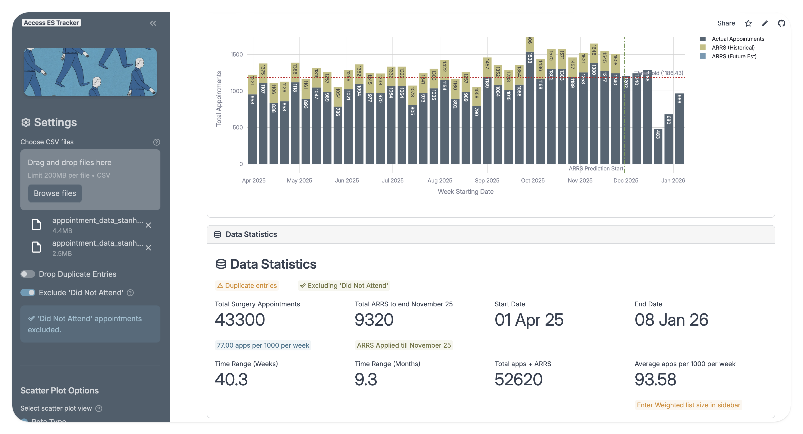

# Access ES Tracker

A Streamlit application for tracking GP surgery appointments and calculating Access metrics for the 2025-26 financial year. The app helps visualize appointment data, excluded "Did Not Attend" cases, and calculates weekly performance rates against targets.


## Features
-   **CSV Data Merging**: Upload multiple appointment CSV files to analyze them as one dataset.
-   **Interactive Filtering**: Filter by Clinician, Rota Type, and Date Range.
-   **DNA Exclusion**: Automatically filters out "Did Not Attend" appointments (toggleable).
-   **ARRS Handling**:
    -   Manual input for ARRS (Additional Roles Reimbursement Scheme) monthly figures.
    -   Future estimation logic to predict performance trends.
    -   *Double-counting prevention warnings*.
-   **Performance Metrics**:
    -   Calculates "Average finished appointments per 1000 patients per week".
    -   Visualizes performance against the target threshold (> 85 per 1000).

## Prerequisites
-   Python 3.8 or higher
-   `pip` (Python package manager)

## Installation

1.  **Clone the repository** (or create a new directory for the project):
    ```bash
    mkdir access-es-tracker
    cd access-es-tracker
    ```

2.  **Create a virtual environment** (recommended):
    ```bash
    python -m venv venv
    source venv/bin/activate  # On Windows use: venv\Scripts\activate
    ```

3.  **Install dependencies**:
    Create a `requirements.txt` file with the following content:
    ```
    streamlit
    pandas
    plotly
    ```
    Then run:
    ```bash
    pip install -r requirements.txt
    ```

## Usage

1.  **Run the application**:
    ```bash
    streamlit run app.py
    ```

2.  **Upload Data**:
    -   Use the sidebar to upload one or more CSV files containing your appointment data.

3.  **Configure Parameters**:
    -   **List Size**: Enter your practice list size (e.g., 10,000).
    -   **Exclude DNA**: Keep checked to remove "Did Not Attend" appointments from calculations.
    -   **ARRS 25/26**: Enter the derived monthly ICB figure for ARRS appointments if needed.
        -   *Note*: If adding ARRS manually, ensure you **deselect** ARRS clinicians from the main "Clinician" filter to avoid double counting.

## Data Format Requirements
The uploaded CSV files must contain the following columns (headers are case-insensitive and spaces are converted to underscores):

| Column Name | Description | Example |
| :--- | :--- | :--- |
| `appointment_date` | Date of the appointment | `01-Apr-25` or `2025-04-01` |
| `clinician` | Name of the clinician | `Dr. Smith`, `Pharm. Jones` |
| `rota_type` | Type of shift/rota | `GP Clinic`, `Extended Access` |
| `appointment_status`| Status of the appointment | `Finished`, `Did Not Attend` |

## Key Logic

### Weekly Rate Calculation
```
Average = (Total Apps + ARRS) / List Size * 1000 / Number of Weeks
```
-   **Total Apps**: Count of unique appointments in the selected date range (excluding DNA).
-   **ARRS**: Manually added figure (optional).
-   **Number of Weeks**: Calculated based on the **selected date range** on the slider (not just the range where data exists). This ensures holidays/weekends are correctly accounted for in the average.

### Payment Thresholds
Badges are displayed based on the weekly rate per 1000 patients:
-   🟢 **100% Payment**: > 85
-   🟡 **75% Payment**: 75 - 85
-   🟠 **< 75% Payment**: < 75
